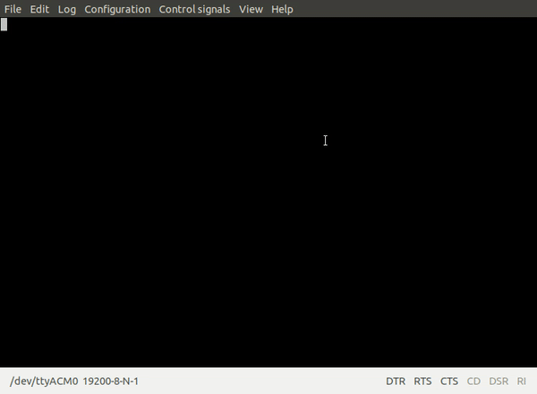

# mbed-os-example-mixed-serial

### Shared Serial UART Example

[SerialBase](https://github.com/ARMmbed/mbed-os/blob/master/drivers/SerialBase.cpp)

    This demonstrates how multiple objects for the same hardware can be instanciated.
    In this case there are two Serial objects using the same physical hardware
    interface.  They have different baud rates configured when outputting data.